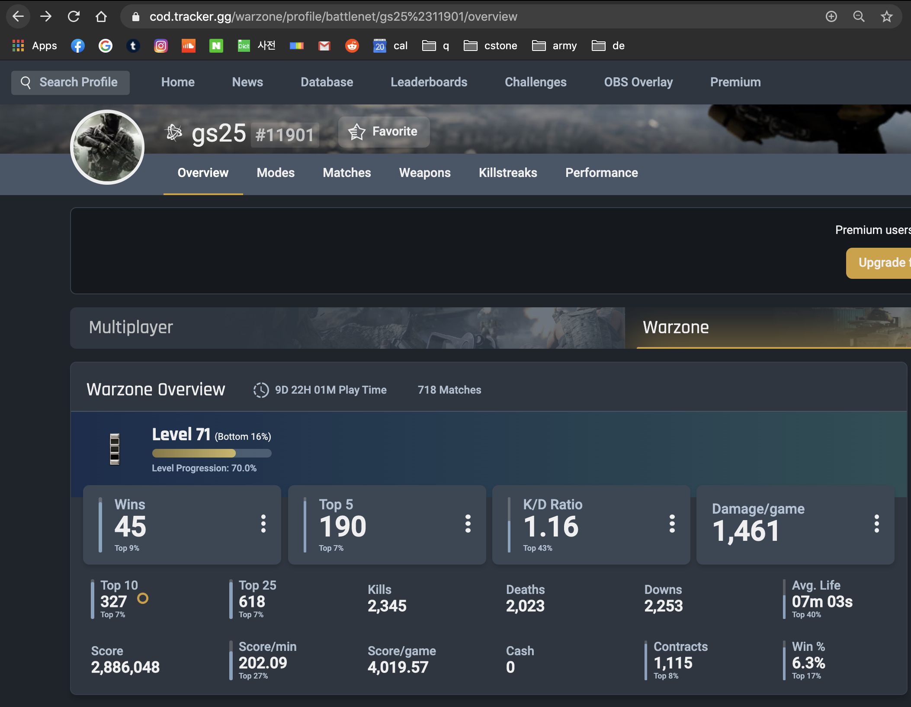
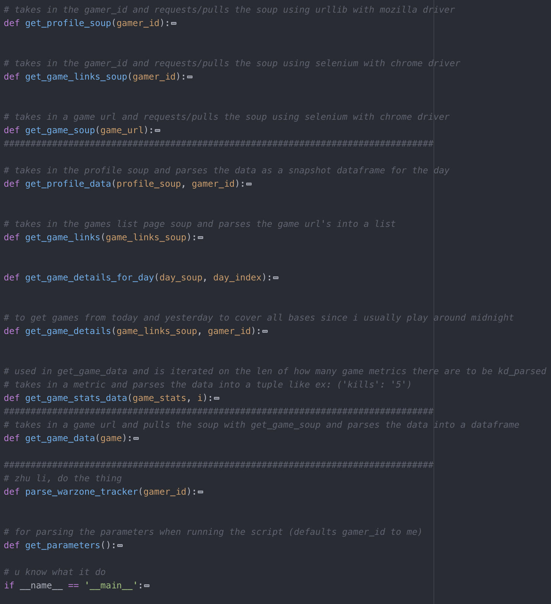
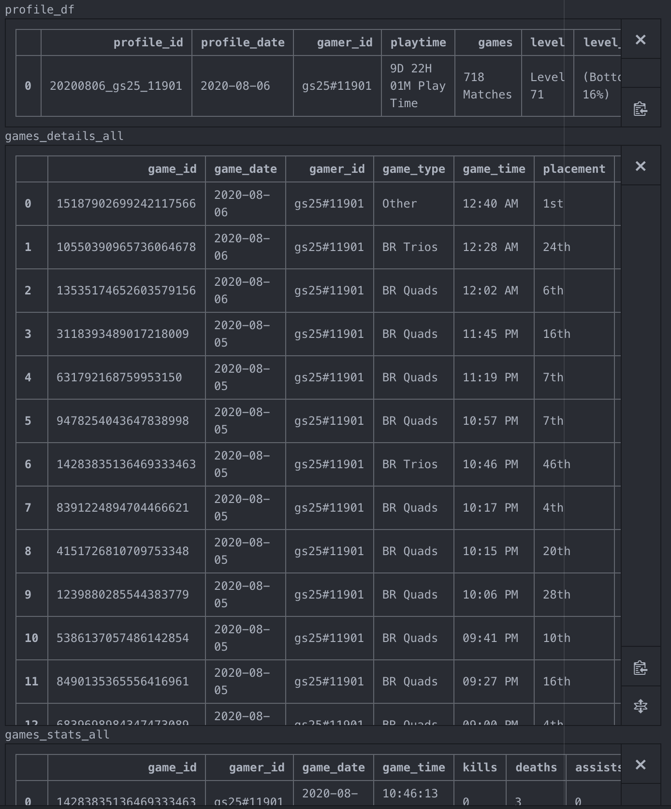

# Call of Duty Warzone Stat Tracker #

### Intro ####
I wanted to make my own ETL with the endstate being a database that is being consistently being updated. I needed a constantly growing data source, so I chose to track my Call of Duty Warzone stats, since I've been playing a lot during quarantine. Also, I wanted to blur the lines between playing and working lol. After all, I need to play for the sake of new data. For now, I've made my database on SQLite to mostly test concepts out. I kicked up an ubuntu EC2 instance on AWS Free Tier, and my plan is to translate all these things from being locally run to running on a cloud-based data warehouse running on my EC2 VM. I also have everything running on a cronjob right now, but eventually I would like to set up Airflow to orchestrate this ETL. I've been looking into setting it up with Docker, but still reading up on it. As for the ETL itself, I've broken it down into 4 stages: the Extractor stage (scraping the data off cod.tracker with BeautifulSoup), the RawData stage (inserting the raw data as text to the db), the Staging stage (the transform layer), and finally the Production stage (upserting to the final tables).

## Data Model ##
|   |   |   |
|---|---|---|
|   |   |   |
|   |   |   |

## Stages ##
### 1. Extractor

- brian_dwh/codwarzone/extractor/warzone_scraper_local.py

- This python script uses urllib requests (for static pages) and selenium on a chrome driver (for dynamic content) to pull profile and game stats from cod.tracker (https://cod.tracker.gg/warzone/profile/battlenet/gs25%2311901/overview) using BeautifulSoup and produces 3 pandas dataframes.

  

   

  + profile
    - a snapshot of my profile stats (https://cod.tracker.gg/warzone/profile/battlenet/gs25%2311901/overview)
  + game_details
    - the previewed game details from my match history (https://cod.tracker.gg/warzone/profile/battlenet/gs25%2311901/matches)
  + game_stats
    - the complete stats from a given game (https://cod.tracker.gg/warzone/match/14818358671278315261?handle=rickytan)

### 2. RawData

### 3. Staging
### 4. Prod
