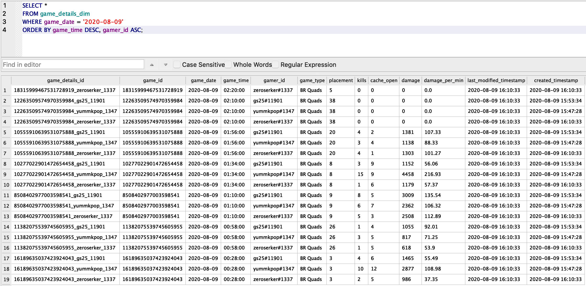

# Call of Duty Warzone Stat Tracker #

### Intro ####
I wanted to make my own ETL with the endstate being a database that is consistently being updated. I needed a constantly growing data source, so I chose to track my Call of Duty Warzone stats, since I've been playing a lot during quarantine. Also, I wanted to blur the lines between playing and working (after all, I need to play for the sake of new data lol). For now, I've made my database on SQLite to mostly test concepts out. I kicked up an EC2 instance and an S3 bucket and successfully uploaded files to the S3 bucket insead of writing as local csv's, but I'm still looking into what DB to use on my VM. As for the ETL itself, I've broken it down into 4 stages: the Extractor stage (scraping the data off cod.tracker with BeautifulSoup), the RawData stage (inserting the raw data as text to the db), the Staging stage (the transform layer), and finally the Production stage (upserting to the final tables).

## Data Model ##
| TBD |   |   |
|---|---|---|
|   |   |   |
|   |   |   |

## Stages ##
### 1. Extractor

- brian_dwh/codwarzone/extractor/warzone_scraper_local.py

- This python script uses urllib requests (for static pages) and selenium on a chrome driver (for dynamic content) to pull profile and game stats from cod.tracker using BeautifulSoup and produces 3 pandas dataframes.

  + profile
    - a snapshot of my profile stats (https://cod.tracker.gg/warzone/profile/battlenet/gs25%2311901/overview)
  + game_details
    - the previewed game details from my match history (https://cod.tracker.gg/warzone/profile/battlenet/gs25%2311901/matches)
  + game_stats
    - the complete stats from a given game (https://cod.tracker.gg/warzone/match/14818358671278315261?handle=rickytan)

  
    

    
  
  
### 2. RawData

- brian_dwh/codwarzone/rawdata/warzone_rawdata_local.py

- This python script executes DDL commands on SQLite to create tables of the 3 dataframes produced by the scraper and DML commands to insert the values from the scraper line by line into the RawData tables. At this stage, it's just about moving the dataframes into SQLite as plain text objects in as much of a 1-to-1 as possible. It creates 3 tables that are near identical to the values from the scraper dataframes, but including values inserted from previous iterations.

  + profile_rawdata
  + game_details_rawdata
  + game_stats_rawdata

~~~~sql
ex:

CREATE TABLE IF NOT EXISTS game_details_rawdata (
  game_id TEXT NOT NULL,
  game_date TEXT NOT NULL,
  game_time TEXT NOT NULL,
  gamer_id TEXT NOT NULL,
  game_type TEXT NOT NULL,
  placement TEXT NOT NULL,
  kills TEXT NOT NULL,
  cache_open TEXT NOT NULL,
  damage TEXT NOT NULL,
  damage_per_min TEXT NOT NULL
);

INSERT OR IGNORE INTO game_details_rawdata ({columns}) VALUES({values});
~~~~

### 3. Staging

- brian_dwh/codwarzone/staging/warzone_staging_local.py

- The Staging layer is where all the transformation and business logic happen. I wanted to keep all the transformations isolated from the rest of the pipeline, so that changes and debugging can be done easily, as it all lives in one place. I've spent too much time in the past trying to track down one edge case error in the transformation logic that's spread across multiple stages of the data. It is sucks. This script creates 3 Staging tables that are essentially queries of the RawData equivalents, but with whatever logic added on. This is also where I nail down what the data type for each dimension is going to be, 

  + profile_staging
  + game_details_staging
  + game_stats_staging

~~~~sql
ex:

CREATE TABLE IF NOT EXISTS game_details_staging AS
SELECT
  CAST(game_id AS VARCHAR) AS game_id,
  DATE(game_date) AS game_date,
  CASE
    WHEN INSTR(game_time, 'AM') > 0 AND INSTR(game_time, '12:') > 0
      THEN TIME(REPLACE(REPLACE(game_time, ' AM', ''), '12:', '00:'))
    WHEN INSTR(game_time, 'AM') > 0
      THEN TIME(REPLACE(game_time, ' AM', ''))
    ELSE TIME(REPLACE(game_time, ' PM', ''), '+12 hours')
  END game_time,
  CAST(gamer_id AS VARCHAR) AS gamer_id,
  CAST(game_type AS VARCHAR) AS game_type,
  CAST(placement AS INT) AS placement,
  CAST(kills AS INT) AS kills,
  CAST(cache_open AS INT) AS cache_open,
  CAST(REPLACE(damage, ',','') AS INT) AS damage,
  CAST(REPLACE(damage_per_min, ',','') AS FLOAT) AS damage_per_min
FROM game_details_rawdata
WHERE game_type != 'Warzone Rumble'
; 
~~~~

### 4. Prod

- brian_dwh/codwarzone/prod/warzone_prod_local.py

- The Prod(uction) layer is where I upsert all the data from the Staging layer into the final end state tables. By now, all logic and tweaks to the data have been made, and it's just about getting it into the prod tables correctly. To do this, I execute DDL commands to create all 3 tables with data types and primary keys defined. Then, I run the DML commands to upsert the data without allowing duplicate rows to happen. If there is a conflict on the primary key, then it updates the row, without adding a new row. I also added some metadata columns- created_timestamp and last_modified_timestamp.

~~~~sql
ex:

CREATE TABLE IF NOT EXISTS game_details_dim (
  game_details_id VARCHAR PRIMARY KEY,
  game_id VARCHAR NOT NULL,
  game_date DATE NOT NULL,
  game_time TIME NOT NULL,
  gamer_id TEXT VARCHAR NULL,
  game_type TEXT NOT NULL,
  placement INT NOT NULL,
  kills INT NOT NULL,
  cache_open INT NOT NULL,
  damage INT NOT NULL,
  damage_per_min FLOAT NOT NULL,
  last_modified_timestamp TIMESTAMP_TZ DEFAULT CURRENT_TIMESTAMP,
  created_timestamp TIMESTAMP_TZ DEFAULT CURRENT_TIMESTAMP
);

INSERT INTO game_details_dim
  SELECT
        game_id || '_' || replace(gamer_id, '#', '_'),
      game_id,
      game_date,
      game_time,
      gamer_id,
      game_type,
      placement,
      kills,
      cache_open,
      damage,
      damage_per_min,
    CURRENT_TIMESTAMP,
    CURRENT_TIMESTAMP
  FROM game_details_staging
  WHERE TRUE
  ORDER BY game_date ASC, game_time ASC
ON CONFLICT(game_details_id) DO UPDATE SET
  game_id = excluded.game_id,
  game_date = excluded.game_date,
  game_time = excluded.game_time,
  gamer_id = excluded.gamer_id,
  game_type = excluded.game_type,
  placement = excluded.placement,
  kills = excluded.kills,
  cache_open = excluded.cache_open,
  damage = excluded.damage,
  damage_per_min = excluded.damage_per_min,
  last_modified_timestamp = CURRENT_TIMESTAMP
;
~~~~

#### Notes ####

+ In creating the prod table, sqlite doesn't support having multiple keys in the ON CONFLICT clause. this makes things annoying because if I want to ingest the games of my friends, there can only be one row for a game. This means the game_id is no longer a unique primary key. I thought of making game_id as a hash of the game_id and the gamer_id, since that's the true unique constraint and grain of the game_details_dim and game_stats_dim table, but sqlite also doesn't have any hashing functions built in (was hoping for SHA1 or MD5). For now, I have a few possible solutions:
  - game_id = game_id || "_" || gamer_id and separate column for game_url_id
  - keep game_id and make new pk for game_details_id and game_stats_id of game_id = game_id || "_" || gamer_id 
    - went with this one.
+ Ideally, I wanted 3 different schemas (RawData, Staging, Prod) for these tables, but SQLite operates as one schema. So... I just made the tables clearly distinguishable.
+ Next steps would be setting up Airflow on my EC2 machine and have these tasks orchestrated by an Airflow DAG instead of a cronjob. I'm also working towards moving the DB from SQLite to probably Postgres. Still tinkering and learning more about how to get these running on my own.
  - Currently running the shell script every night
    ~~~
    # codwarzone scraper set to 11:50 PM EST (03:50 AM GMT)
    50 03 * * * shells/codwarzone_etl.sh
    ~~~
  - The shell script just runs each script in the ETL.
    ~~~
    #!/bin/bash
    echo "running codwarzone_etl.sh for scraping warzone stats and building rawdata, staging, and prod tables."

    cd ~/brian/work/repo/brian_dwh/codwarzone
    python3 extractor/warzone_scraper_local.py
    python3 rawdata/warzone_rawdata_local.py
    python3 staging/warzone_staging_local.py
    python3 prod/warzone_prod_local.py

    echo "warzone etl done."
    ~~~
+ I was able to write and read the dataframes to my S3 bucket from the AWS Free-Tier. I wanted to test it out, but wasn't sure about the Free-Tier storage caps, so I commented those lines out and just wrote to csv. But the S3 uploads and downloads worked great.
  - 
 
